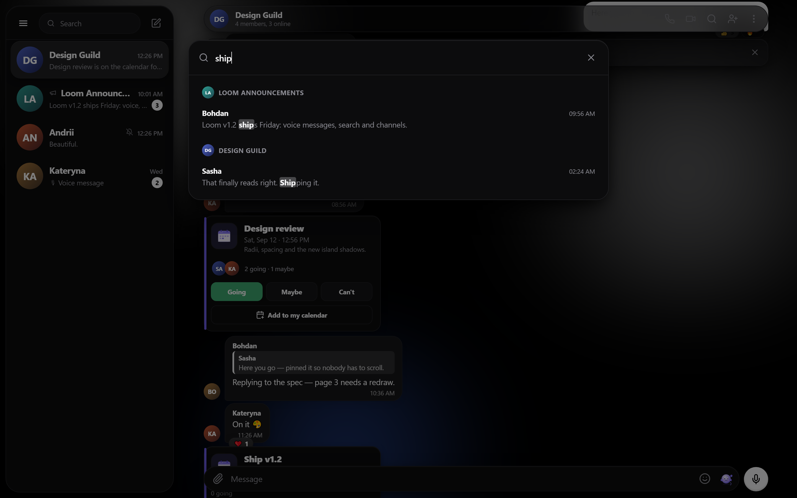
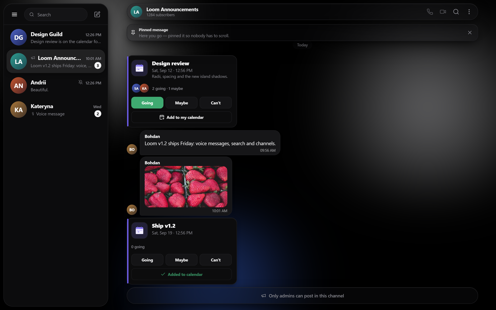
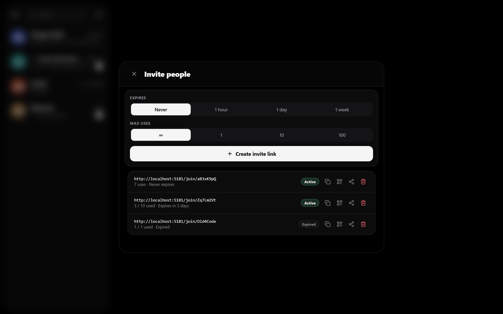
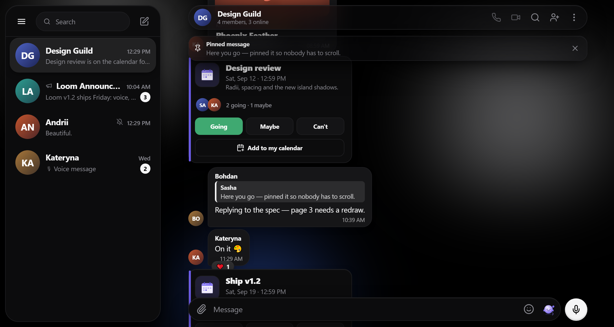
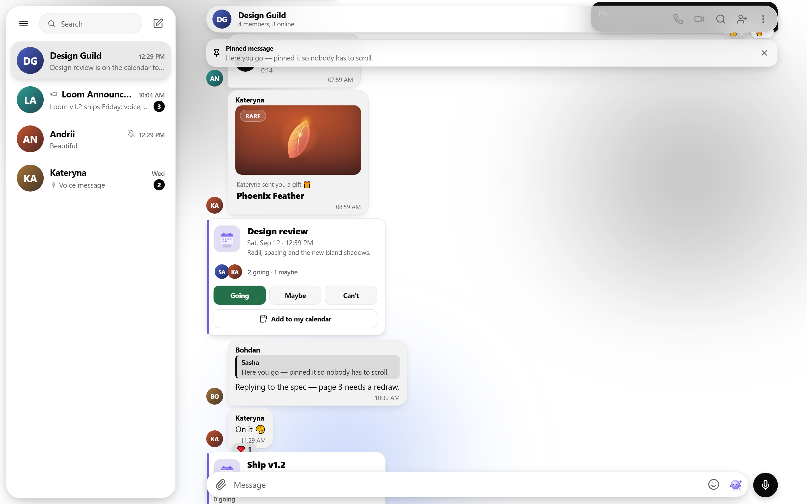
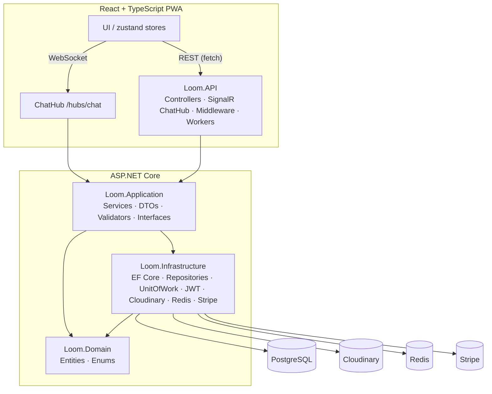

# Loom — Real-time Messenger

> A full-stack, Telegram-style real-time messenger with voice messages, message search, channels, group permissions and invite links, a built-in event planner, a Stars virtual economy, collectible gifts, Premium, stickers, and living themes — built solo and deployed live.

[](https://dotnet.microsoft.com/)
[](https://learn.microsoft.com/aspnet/core)
[](https://www.postgresql.org/)
[](https://learn.microsoft.com/aspnet/core/signalr/introduction)
[](https://react.dev/)
[](https://www.typescriptlang.org/)
[](https://www.docker.com/)
[](https://railway.app/)

**🔴 Live demo:** https://sweet-tranquility-production.up.railway.app


<p align="center"><sub>The conversation view — chat-list island over a full-bleed canvas, a pinned message bar, a collectible gift card, a shared event with live RSVP, quoted replies and reactions.</sub></p>

---

## Overview

**Loom** is a production-style, real-time messenger built end to end — a .NET / ASP.NET Core Web API with PostgreSQL and SignalR on the backend, and a React + TypeScript PWA on the frontend, all containerized with Docker and deployed live on Railway.

It goes well beyond a basic chat app: direct chats, groups and broadcast channels with live delivery, presence and typing indicators; **voice messages**, **full-text message search**, **role-based group permissions** and **invite links with QR codes**; a Stars currency with atomic money movement and **Stripe checkout**; collectible gifts delivered as in-chat cards; a shared event planner with RSVP that syncs live; Premium subscriptions, stickers, and a refined light/dark design system across five accent themes.

The client is built for the unreliable-network reality of a messenger: **optimistic UI** everywhere with rollback on failure, a **persisted offline queue** that survives a reload and flushes on reconnect, in-app **notifications** (sound, tab-title counter, favicon badge, browser notifications), and keyboard/screen-reader accessibility throughout. The UI is fully responsive — a desktop island layout and a native-feeling mobile layout from the same components.

---

## Features

### 💬 Messaging
Direct chats, groups and **channels** · paged history · edit / delete · **reply** · **forward** · **pin** · reactions · read receipts · unread badges · date separators · sticker packs · **per-chat mute**. Group messages show the sender's avatar and name (tap → their profile → start a DM).

A **context menu** (right-click on desktop, long-press on touch) puts reply, a quick-reaction row, copy, forward, pin and — on your own messages — edit and delete one gesture away.

### 🔎 Message search
Full-text search across every chat you're in, or scoped to the current conversation. Results are grouped by chat with the matched term highlighted; clicking one **jumps to that message**, paging back through history if the hit is older than what's loaded. `Cmd/Ctrl+K` opens it from anywhere.



### 🎙️ Voice messages
Hold to record with a live level meter and elapsed time, release to send. Playback has play/pause, a scrubbable waveform and duration; only one plays at a time. Recorded with `MediaRecorder`, uploaded to Cloudinary, and shown optimistically while it uploads.

### 📣 Channels & group permissions
**Channels** are broadcast chats — they read differently in the list and header (subscribers, not members), and when you can't post the composer is replaced by a plain *"Only admins can post in this channel"* bar rather than a composer that fails.



**Roles** are real and enforced server-side: Owner / Admin / Member. Admins can edit the group and remove members; only the Owner can promote, demote or delete. The UI never offers an action your role can't perform, and it re-reads the truth if a role changes while the screen is open.

<p align="center">
  
  
</p>

### 🔗 Invite links
Create links with an **expiry** (never / 1 hour / 1 day / 1 week) and a **usage limit** (unlimited / 1 / 10 / 100), see how many uses each has left, copy or share them, show a **QR code** for sharing in person, and revoke any of them. Opening a link lands on a **join screen** showing the group before you commit — and if you're signed out, the invite survives login or registration and takes you straight back.

### ⚡ Real-time (SignalR)
A single hub (`/hubs/chat`, JWT-authenticated via query token) powers live new messages, **presence** (online / last seen), **typing** indicators, and live propagation of **edits, deletes, reactions, pins and read receipts** — plus live event cards. Auto-reconnect with room re-join; the client joins every chat's group so updates arrive even for chats that aren't open.

### 📶 Optimistic UI & offline queue
Sends, reactions, RSVPs, edits, pins and mutes all apply **instantly** and roll back if the server disagrees. When the network drops, messages don't fail — they queue with a *"waiting for connection"* state, **survive a page reload** (persisted outbox), and flush in order once connectivity returns. A 4xx is treated as a real rejection and never queued; only transport errors are.

### 🖼️ Media
Image / file / voice / avatar upload via **Cloudinary**, routed to the right resource type. **Drag & drop** files anywhere in a conversation, or **paste** an image straight from the clipboard. Uploads show **real progress** and can be cancelled mid-flight. Photos open in a **fullscreen lightbox** with zoom, pan, swipe between every photo in the chat, and download. A **shared-media gallery** in chat info groups photos and files by month.

### 😀 Emoji & stickers
A full **emoji picker** with categories, search, recents and skin tones — in the composer and for reactions — alongside the crafted sticker packs.

### 🔔 Notifications
A rate-limited sound for messages in other chats, an unread counter in the **tab title**, a **favicon badge**, and **browser notifications** when the tab is in the background (asked for politely, never on load). All of it is toggleable and remembered.

### 🗓️ Calendar & Events
Create personal plans or share an **event card into a chat**. Cards carry **RSVP** (Going / Maybe / Can't) with **live attendee counts & avatars** (synced to everyone via SignalR), an **Add to my calendar** action, and a personal calendar view. Share an existing plan from the calendar into any chat.



### 🎁 Virtual economy — Stars, Gifts & Premium
Buy **Stars** with **Stripe Checkout** (webhook-driven, idempotent crediting), view your ledger, and spend them on **collectible gifts** (crafted 3D objects with rarities) — sending a gift **atomically deducts stars** and drops a **gift card message** into the recipient's DM in real time. **Premium** unlocks perks including an animated gradient display name.

<p align="center">
  
  
</p>

### 🎨 Design system — light & dark
Token-driven monochrome design with colorful crafted objects, five accent themes and living wallpapers. Every surface is theme-aware, and every text/background pair is checked against WCAG AA contrast in all ten theme × mode combinations.

<p align="center">
  
  
</p>
<p align="center"><sub>The same screen, light and dark — one token set, no per-theme components.</sub></p>

<p align="center">
  
  
  
</p>

### ♿ Accessibility
Full keyboard navigation (arrow keys through the chat list and menus, `Cmd/Ctrl+K` for search, `/` for the composer, `Esc` everywhere), focus trapping and restoration in every dialog, visible focus rings, `aria` roles and labels on every control, and `prefers-reduced-motion` respected throughout.

### 📱 Responsive & PWA
Installable PWA. Desktop uses a resizable island layout with a burger menu; mobile uses a fixed bottom navigation bar — same components, breakpoint-driven.

<p align="center"></p>

---

## Tech stack

| Layer | Technologies |
|---|---|
| **Backend** | .NET 10 · ASP.NET Core Web API · EF Core 10 (Npgsql) · **PostgreSQL 16** · **SignalR** · **Redis** (distributed cache) · **Stripe** (payments) · JWT auth (`JwtBearer`) with **rotating refresh tokens** · **BCrypt** password hashing · **FluentValidation** · **AutoMapper** · rate limiting · health checks · hosted background workers · Swagger / Swashbuckle |
| **Frontend** | **React 18** · **TypeScript** · **Vite 6** · PWA (`vite-plugin-pwa`) · `@microsoft/signalr` · **zustand** · React Router · lucide-react |
| **Testing** | **xUnit** · **Moq** · **FluentAssertions** (service-layer unit tests) |
| **Infra** | **Docker** & Docker Compose · **Cloudinary** (media) · **Redis** · **Railway** (hosting) · nginx (frontend + reverse proxy) |

---

## Architecture

Onion / Clean Architecture — dependencies point inward; the domain has no external dependencies, and infrastructure concerns (EF Core, Cloudinary, JWT) are isolated behind interfaces defined in the Application layer.



**Projects**

| Project | Responsibility |
|---|---|
| `Loom.Domain` | Entities & enums — pure, no dependencies |
| `Loom.Application` | Business logic: services, DTOs, FluentValidation validators, AutoMapper profiles, repository/service interfaces |
| `Loom.Infrastructure` | EF Core `DbContext`, repositories, Unit of Work, JWT generation, Cloudinary, Redis cache, Stripe, migrations |
| `Loom.API` | Controllers, the SignalR `ChatHub`, JWT auth, rate limiting, health checks, background workers, global exception handling, DI wiring |
| `Loom.Tests` | xUnit + Moq + FluentAssertions unit tests over the service layer |

---

## Engineering highlights

- **Real-time everything** — SignalR hub delivers messages, presence, typing, and live edits/reactions/pins/reads/RSVP; the client auto-reconnects and re-joins rooms.
- **Built for a bad network** — optimistic UI with rollback on every mutation, and a persisted outbox that keeps unsent messages across a reload and flushes them in order on reconnect. Transport failures queue; 4xx rejections don't.
- **Atomic money movement** — buying stars, sending gifts, and Premium purchases run inside **DB transactions via a Unit of Work**, so balances never drift (with graceful *"not enough stars"* handling).
- **Secure auth** — JWT access tokens + **rotating (single-use) refresh tokens**, with **silent refresh** on the client (single in-flight, cross-tab-safe via the Web Locks API) so sessions survive expiry and transient outages without logging users out.
- **IDOR protection & role enforcement** — ownership/membership checks on every resource, plus Owner/Admin/Member rules enforced server-side (`ForbiddenException` → 403) and mirrored in the UI so an action you can't perform is never offered.
- **Cache-aside with Redis** — hot reads go through a distributed cache with TTLs and explicit invalidation; when `Redis:Connection` is absent the container swaps in a no-op cache and the app runs unchanged.
- **Background workers** — hosted services prune expired refresh tokens and reconcile stale presence, so neither depends on a request arriving.
- **Rate limiting & health checks** — a fixed-window limiter per IP (429 on exceed) and a health endpoint that probes the database.
- **Payments done carefully** — Stripe Checkout with a webhook that credits stars **idempotently**, so a retried or duplicated event can't double-credit.
- **Global exception handling** → RFC-7807 **ProblemDetails** responses.
- **Tested service layer** — unit tests for Auth, Chat, Message, Gift and Star services.
- **Accessible by default** — keyboard paths for every action, focus trapping/restoration in dialogs, `aria` labelling, and WCAG AA contrast verified across all five themes in light and dark.
- **Lean first load** — heavy, rarely-used surfaces (lightbox, emoji picker, QR generator, media gallery, calendar, the crafted-gift SVG library) are code-split; long threads and the chat list are memoised so an incoming message re-renders one row, not the screen.
- **Fully containerized & deployed** — one-command local stack; live on Railway with env-based config and an nginx reverse proxy (so the SPA and API are same-origin — no CORS).

---

## Getting started

### Prerequisites
- [Docker](https://www.docker.com/) & Docker Compose
- (For running tests / backend outside Docker) [.NET 10 SDK](https://dotnet.microsoft.com/) and Node 20+

### Run the whole stack (one command)
```bash
docker compose up --build
```
This brings up **PostgreSQL + the API + the frontend** together.

| Service | URL |
|---|---|
| Frontend (nginx) | http://localhost:3000 |
| API | http://localhost:5036 |
| Swagger | http://localhost:5036/swagger |
| Health | http://localhost:5036/health |
| PostgreSQL | localhost:5434 |

### Configuration (env)
The API reads configuration from `appsettings.json` / environment variables:

```jsonc
{
  "ConnectionStrings": { "DefaultConnection": "Host=db;Port=5432;Database=LoomDb;Username=postgres;Password=..." },
  "Jwt": { "Key": "<32+ char secret>", "Issuer": "LoomApi", "Audience": "LoomClient", "AccessTokenMinutes": 30, "RefreshTokenDays": 30 },
  "Cloudinary": { "CloudName": "...", "ApiKey": "...", "ApiSecret": "..." },
  "Redis":      { "Connection": "..." },          // optional — omit and caching no-ops
  "Stripe":     { "SecretKey": "...", "WebhookSecret": "...", "SuccessUrl": "...", "CancelUrl": "..." }
}
```
The frontend needs `VITE_API_BASE_URL` (empty = same-origin, resolved by the nginx reverse proxy). EF Core migrations are applied automatically on API startup.

### Run tests
```bash
dotnet test
```

### Frontend dev server
```bash
cd loom-web
npm install
npm run dev   # http://localhost:5173 (proxies /api and /hubs to the API)
```

---

## Deployment (Railway)

Three services on Railway — **PostgreSQL**, the **API**, and the **frontend** — configured entirely through environment variables:

- **API**: `ConnectionStrings__DefaultConnection` (Railway Postgres), `Jwt__*`, `Cloudinary__*`; listens on `$PORT`.
- **Frontend**: an nginx image whose config is templated at container start (`envsubst`) — it listens on Railway's injected **`$PORT`** and reverse-proxies `/api` and `/hubs` to the API via **`API_URL`**, keeping the SPA and API same-origin.

---

## What I learned / engineering decisions

- **Real-time UX is a system, not a feature.** Getting presence, typing, optimistic sends, reconnection, and cross-tab token refresh to feel seamless required careful state design (a single normalized store, single-in-flight refresh, Web-Locks coordination).
- **Money needs transactions.** Stars/gifts/premium taught me to make balance changes atomic (Unit of Work + DB transactions) and to fail loudly and gracefully.
- **Clean Architecture pays off** when features pile up — swapping infrastructure and unit-testing services stayed easy because the domain and application layers never depend on frameworks.
- **Optimism needs a rollback plan.** Making every action feel instant is the easy half; the hard half is deciding what a failure means. Separating "the server said no" (4xx — surface it) from "the network did" (queue and retry) is what made offline behaviour trustworthy rather than lossy.
- **Degrade, don't depend.** Redis is a cache, not a requirement — no connection string and the app swaps in a no-op implementation and keeps working. The same instinct drove the offline queue and the render error boundaries.
- **Ship it.** Containerizing and deploying to Railway (env-based config, `$PORT`, reverse-proxied same-origin frontend) turned a codebase into a live product.

---

<sub>Built with .NET, ASP.NET Core, PostgreSQL, Redis, SignalR, React & TypeScript. Frontend and backend in one monorepo; one-command Docker stack; deployed on Railway.</sub>
