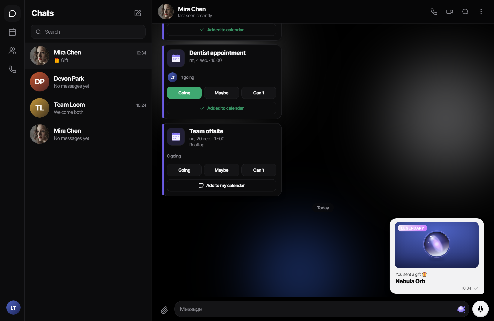
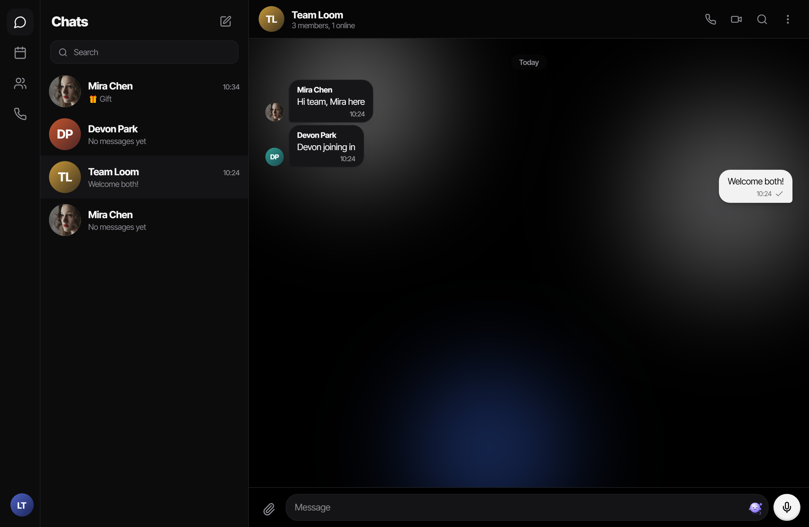
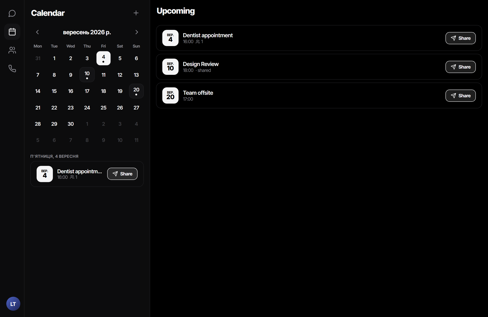
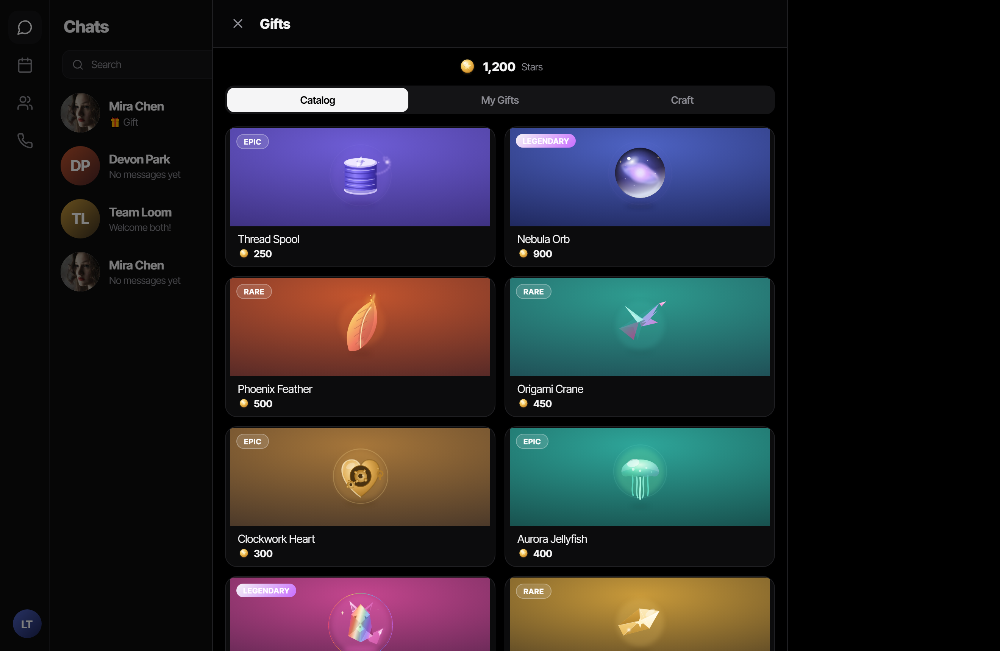
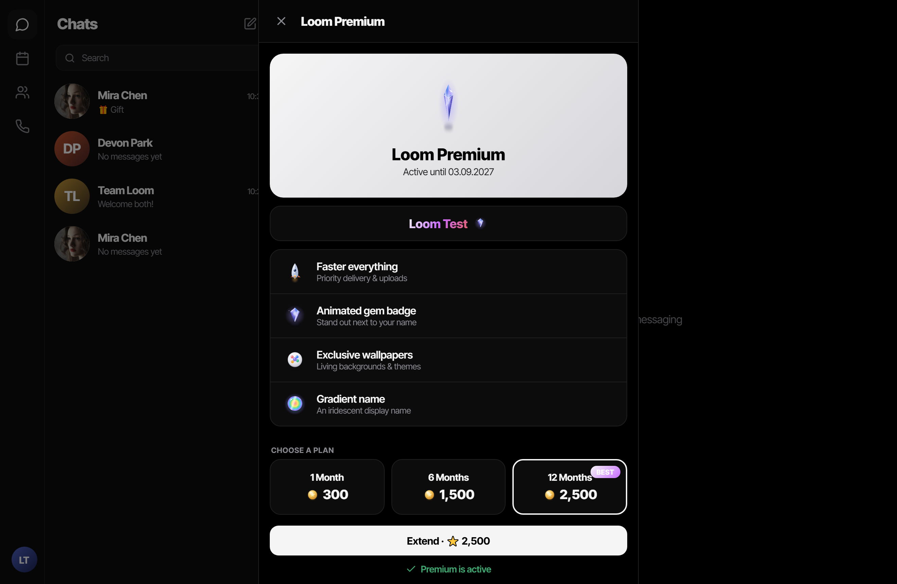
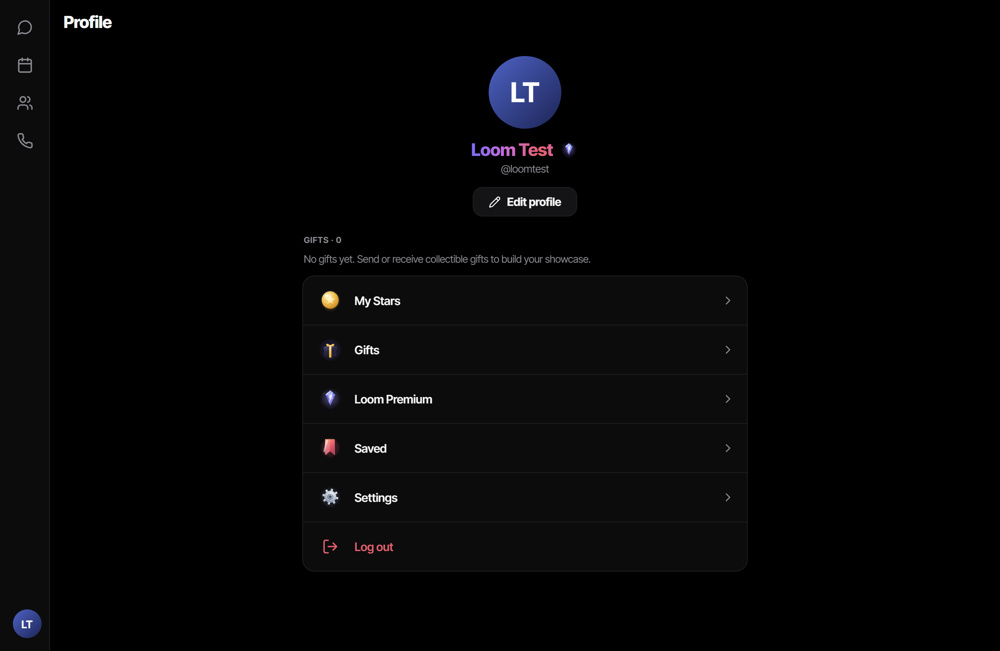
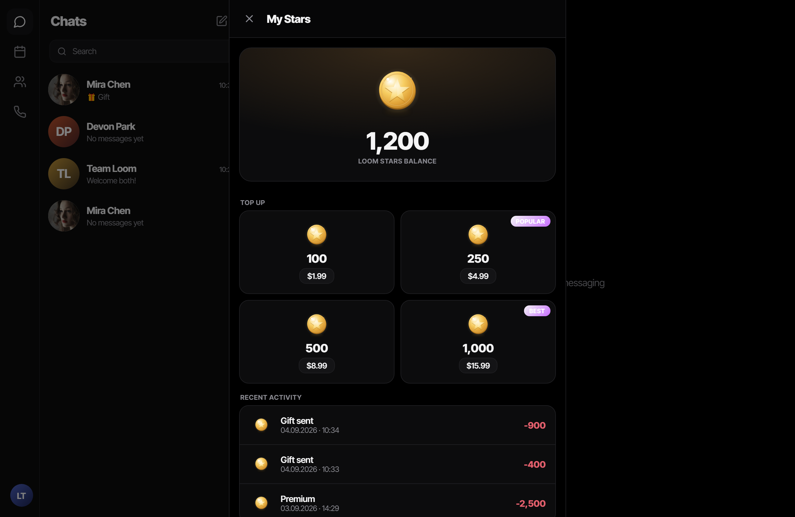
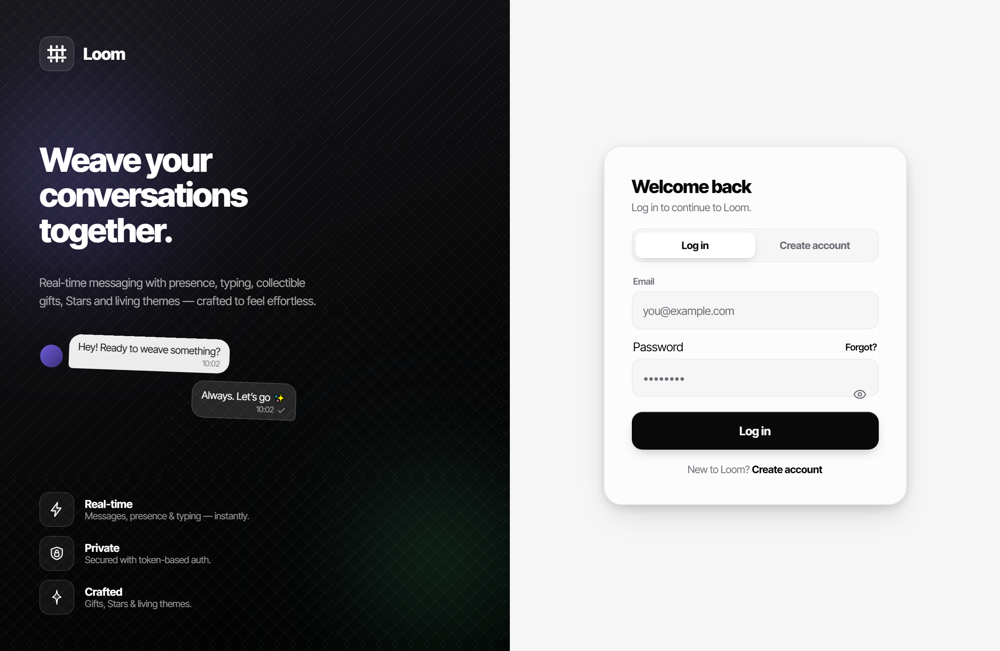
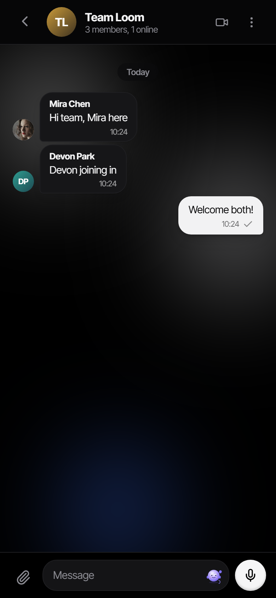
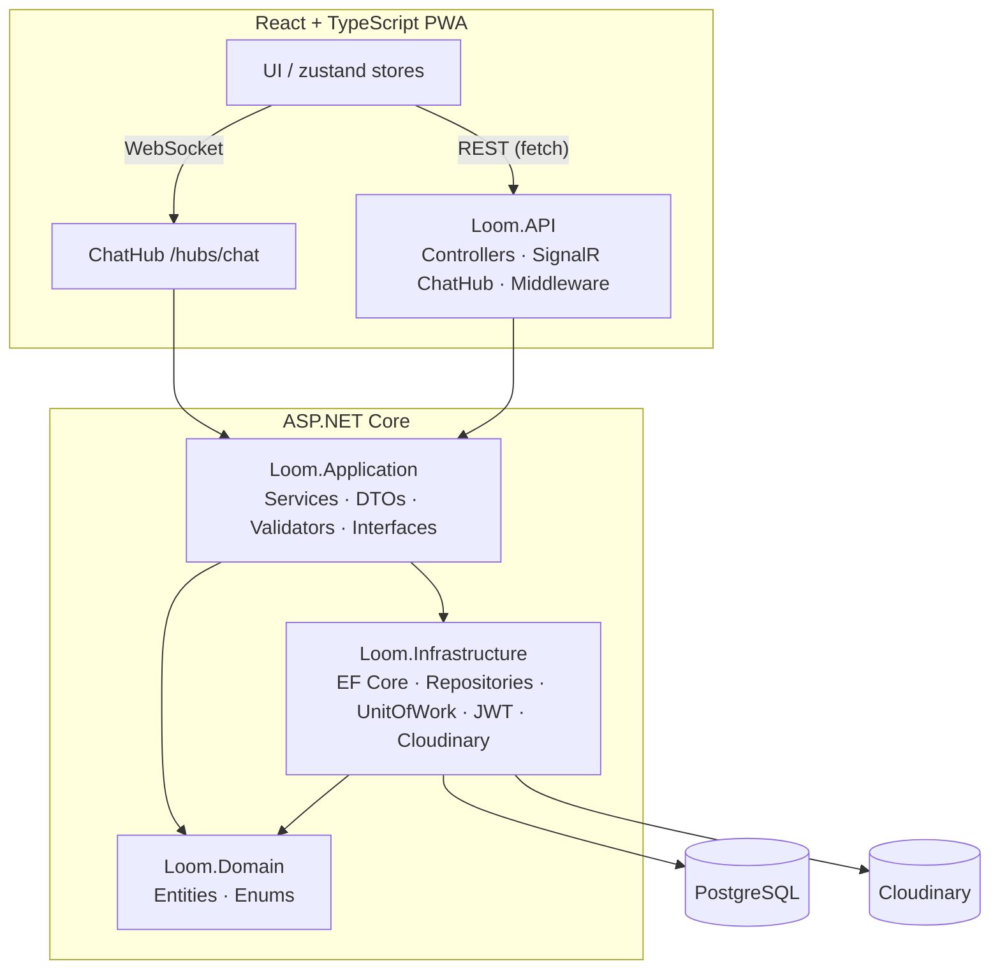

# Loom — Real-time Messenger

> A full-stack, Telegram-style real-time messenger with a built-in event planner, a Stars virtual economy, collectible gifts, Premium, stickers, and living themes — built solo and deployed live.

[](https://dotnet.microsoft.com/)
[](https://learn.microsoft.com/aspnet/core)
[](https://www.postgresql.org/)
[](https://learn.microsoft.com/aspnet/core/signalr/introduction)
[](https://react.dev/)
[](https://www.typescriptlang.org/)
[](https://www.docker.com/)
[](https://railway.app/)

**🔴 Live demo:** https://sweet-tranquility-production.up.railway.app



---

## Overview

**Loom** is a production-style, real-time messenger built end to end — a .NET / ASP.NET Core Web API with PostgreSQL and SignalR on the backend, and a React + TypeScript PWA on the frontend, all containerized with Docker and deployed live on Railway.

It goes well beyond a basic chat app: direct/group/channel conversations with live delivery, presence and typing indicators, a Stars currency with atomic money movement, collectible gifts delivered as in-chat cards, a shared event planner with RSVP that syncs live, Premium subscriptions, stickers, and a refined light/dark design system. The UI is fully responsive (desktop 2-pane + mobile) and localized-friendly.

---

## Features

### 💬 Messaging
Direct chats, groups, and channels · paged message history · edit / delete · reply · reactions · read receipts · unread badges (per-chat + total) · date separators · sticker packs. Group messages show the sender's avatar & name (tap → their profile → start a DM).



### ⚡ Real-time (SignalR)
A single hub (`/hubs/chat`, JWT-authenticated via query token) powers live new messages, **presence** (online / last seen), **typing** indicators, and live propagation of **edits, deletes, reactions and read receipts** — plus live event cards. Auto-reconnect with room re-join; the client joins every chat's group so updates arrive even for chats that aren't open.

### 🗓️ Calendar & Events
Create personal plans or share an **event card into a chat**. Cards carry **RSVP** (Going / Maybe / Can't) with **live attendee counts & avatars** (synced to everyone via SignalR), an **Add to my calendar** action, and a personal calendar view. Share an existing plan from the calendar into any chat.



### 🎁 Virtual economy — Stars, Gifts & Premium
Buy **Stars**, view your ledger, and spend them on **collectible gifts** (12 crafted 3D objects with rarities) — sending a gift **atomically deducts stars** and drops a **gift card message** into the recipient's DM in real time. **Premium** unlocks perks including an animated gradient display name.

<p align="center">
  
  
</p>

### 🖼️ Media
Image / file / avatar upload via **Cloudinary**; avatars render as clean cropped circles.

### 🎨 Design system — light & dark
Token-driven monochrome design with colorful crafted objects, five accent themes and living wallpapers. Every surface is theme-aware.

<p align="center">
  
  
  
</p>

### 📱 Responsive & PWA
Installable PWA; desktop uses a resizable 2-pane layout, mobile uses a fixed bottom navigation bar.

<p align="center"></p>

---

## Tech stack

| Layer | Technologies |
|---|---|
| **Backend** | .NET 10 · ASP.NET Core Web API · EF Core 10 (Npgsql) · **PostgreSQL 16** · **SignalR** · JWT auth (`JwtBearer`) with **rotating refresh tokens** · **BCrypt** password hashing · **FluentValidation** · **AutoMapper** · Swagger / Swashbuckle |
| **Frontend** | **React 18** · **TypeScript** · **Vite 6** · PWA (`vite-plugin-pwa`) · `@microsoft/signalr` · **zustand** · React Router · lucide-react |
| **Testing** | **xUnit** · **Moq** · **FluentAssertions** (service-layer unit tests) |
| **Infra** | **Docker** & Docker Compose · **Cloudinary** (media) · **Railway** (hosting) · nginx (frontend + reverse proxy) |

---

## Architecture

Onion / Clean Architecture — dependencies point inward; the domain has no external dependencies, and infrastructure concerns (EF Core, Cloudinary, JWT) are isolated behind interfaces defined in the Application layer.



**Projects**

| Project | Responsibility |
|---|---|
| `Loom.Domain` | Entities & enums — pure, no dependencies |
| `Loom.Application` | Business logic: services, DTOs, FluentValidation validators, AutoMapper profiles, repository/service interfaces |
| `Loom.Infrastructure` | EF Core `DbContext`, repositories, Unit of Work, JWT generation, Cloudinary, migrations |
| `Loom.API` | Controllers, the SignalR `ChatHub`, JWT auth, global exception handling, DI wiring |
| `Loom.Tests` | xUnit + Moq + FluentAssertions unit tests over the service layer |

---

## Engineering highlights

- **Real-time everything** — SignalR hub delivers messages, presence, typing, and live edits/reactions/reads/RSVP; the client auto-reconnects and re-joins rooms.
- **Atomic money movement** — buying stars, sending gifts, and Premium purchases run inside **DB transactions via a Unit of Work**, so balances never drift (with graceful *"not enough stars"* handling).
- **Secure auth** — JWT access tokens + **rotating (single-use) refresh tokens**, with **silent refresh** on the client (single in-flight, cross-tab-safe via the Web Locks API) so sessions survive expiry and transient outages without logging users out.
- **IDOR protection** — ownership/membership checks on every resource (you can only read/edit what you're a member of or own).
- **Global exception handling** → RFC-7807 **ProblemDetails** responses.
- **Tested service layer** — unit tests for Auth, Chat, Message, Gift and Star services.
- **Fully containerized & deployed** — one-command local stack; live on Railway with env-based config and an nginx reverse proxy (so the SPA and API are same-origin — no CORS).

---

## Getting started

### Prerequisites
- [Docker](https://www.docker.com/) & Docker Compose
- (For running tests / backend outside Docker) [.NET 10 SDK](https://dotnet.microsoft.com/) and Node 20+

### Run the whole stack (one command)
```bash
docker compose up --build
```
This brings up **PostgreSQL + the API + the frontend** together.

| Service | URL |
|---|---|
| Frontend (nginx) | http://localhost:3000 |
| API | http://localhost:5036 |
| Swagger | http://localhost:5036/swagger |
| PostgreSQL | localhost:5434 |

### Configuration (env)
The API reads configuration from `appsettings.json` / environment variables:

```jsonc
{
  "ConnectionStrings": { "DefaultConnection": "Host=db;Port=5432;Database=LoomDb;Username=postgres;Password=..." },
  "Jwt": { "Key": "<32+ char secret>", "Issuer": "LoomApi", "Audience": "LoomClient", "AccessTokenMinutes": 30, "RefreshTokenDays": 30 },
  "Cloudinary": { "CloudName": "...", "ApiKey": "...", "ApiSecret": "..." }
}
```
The frontend needs `VITE_API_BASE_URL` (empty = same-origin, resolved by the nginx reverse proxy). EF Core migrations are applied automatically on API startup.

### Run tests
```bash
dotnet test
```

### Frontend dev server
```bash
cd loom-web
npm install
npm run dev   # http://localhost:5173 (proxies /api and /hubs to the API)
```

---

## Deployment (Railway)

Three services on Railway — **PostgreSQL**, the **API**, and the **frontend** — configured entirely through environment variables:

- **API**: `ConnectionStrings__DefaultConnection` (Railway Postgres), `Jwt__*`, `Cloudinary__*`; listens on `$PORT`.
- **Frontend**: an nginx image whose config is templated at container start (`envsubst`) — it listens on Railway's injected **`$PORT`** and reverse-proxies `/api` and `/hubs` to the API via **`API_URL`**, keeping the SPA and API same-origin.

---

## What I learned / engineering decisions

- **Real-time UX is a system, not a feature.** Getting presence, typing, optimistic sends, reconnection, and cross-tab token refresh to feel seamless required careful state design (a single normalized store, single-in-flight refresh, Web-Locks coordination).
- **Money needs transactions.** Stars/gifts/premium taught me to make balance changes atomic (Unit of Work + DB transactions) and to fail loudly and gracefully.
- **Clean Architecture pays off** when features pile up — swapping infrastructure and unit-testing services stayed easy because the domain and application layers never depend on frameworks.
- **Ship it.** Containerizing and deploying to Railway (env-based config, `$PORT`, reverse-proxied same-origin frontend) turned a codebase into a live product.

---

<sub>Built with .NET, ASP.NET Core, PostgreSQL, SignalR, React & TypeScript. Frontend and backend in one monorepo; one-command Docker stack; deployed on Railway.</sub>
